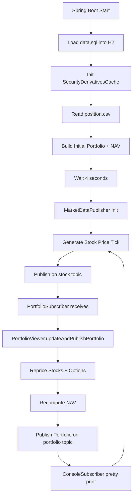

# End-to-End Data Flow (Simple Hindi + Diagram Style)

## 1. Startup se Output tak Flow

1. Application boot hoti hai.
2. H2 data.sql execute hota hai aur stock/options master data load hota hai.
3. Derivatives cache memory me load hota hai.
4. Position CSV read hota hai aur initial Portfolio build hota hai.
5. 4 second delay ke baad market publisher start hota hai.
6. Har stock ke liye random price updates generate hote hain.
7. PortfolioSubscriber stock price events consume karta hai.
8. PortfolioViewer stock aur options dono reprice karta hai.
9. NAV recalculate hota hai.
10. Updated Portfolio portfolio topic par publish hota hai.
11. ConsoleSubscriber final output console par print karta hai.

## 2. Diagram (Mermaid)

## 3. Major Runtime Data Structures

1. derivativeCache
   - Key: option symbol
   - Value: SecurityDefinition

2. Portfolio
   - stockElements: underlying wise map
   - optionsElements: underlying wise list map
   - nav: net asset value

3. Market price map
   - Key: stock code
   - Value: latest simulated price

## 4. Repricing Logic Summary

1. Agar stock position hai:
   - Latest stock price se position value recalc.
2. Agar options positions hain:
   - Latest underlying price + strike + maturity + volatility + type se option price recalc.
3. Dono values sum karke NAV update.

## 5. Operational Notes

1. System event-driven hai, polling based nahi.
2. Portfolio updates sirf tab hoti hain jab tracked underlying ka event aaye.
3. Console output live stream style me aata hai.

## 6. Failure Hotspots

1. CSV file missing/invalid format.
2. Option definitions cache miss.
3. JMS destination config mismatch.
4. Maturity date anomalies.
5. Long-running timer tasks during shutdown.

## 7. Next Step for Production

1. Structured logging add karo.
2. Health endpoints tune karo.
3. Graceful shutdown hooks add karo.
4. Resource loading classpath-safe banao.
5. Integration tests for startup + event flow likho.
